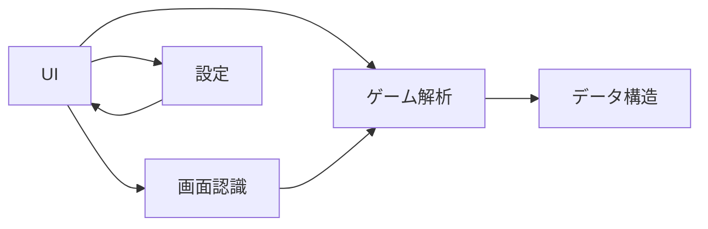

# モジュール構成図

## 1. モジュール構成の概要
3マッチパズルゲームソルバーアプリケーションは、以下の主要なモジュールから構成されます。

1. **UIモジュール**:
    - ユーザーインターフェースを提供するモジュールです。
    - 画面表示、ユーザーからの入力を処理します。
    - オーバーレイ表示機能、解析開始ボタン、解析結果表示などを担当します。

2. **画面認識モジュール**:
    - Androidスマートフォンの画面をキャプチャし、ゲーム盤面を認識するモジュールです。
    - 画像処理技術を用いて、盤面のピース配置、ピースの種類などを 認識 します。

3. **ゲーム解析モジュール**:
    - 認識されたゲーム盤面データを受け取り、最適手を解析するモジュールです。
    - ゲームロジック、評価関数、探索アルゴリズムなどを実装します。

4. **設定モジュール**:
    - アプリケーションの設定を管理するモジュールです。
    - 言語設定、解析パラメータ設定などを管理します。

## 2. モジュール間の依存関係
各モジュール間の依存関係を以下に示します。

- **UIモジュール** は、ユーザーからの入力を受け付け、画面表示を行います。画面認識モジュール、ゲーム解析モジュール、設定モジュールと連携します。
- **画面認識モジュール** は、UIモジュールからの指示を受けて画面キャプチャを行い、ゲーム盤面を認識します。認識した盤面データをゲーム解析モジュールに 伝達 します。
- **ゲーム解析モジュール** は、画面認識モジュールから受け取った盤面データに基づいて最適手を解析します。解析結果をUIモジュールに 返します。
- **設定モジュール** は、アプリケーションの設定情報を管理します。UIモジュールから設定変更要求を受け付け、設定情報をUIモジュールに 提供します。

## 3. 各モジュールの詳細

### 3.1. UIモジュール
- **役割**: ユーザーインターフェースの提供、ユーザー入力処理、画面表示
- **主要機能**:
    - オーバーレイ表示、解析開始ボタン、解析結果表示
    - 言語切り替え機能
    - 設定画面表示、設定変更受付

### 3.2. 画面認識モジュール
- **役割**: 画面キャプチャ、ゲーム盤面認識
- **主要機能**:
    - 画面キャプチャ機能 (Android API 使用)
    - 画像 пред-обработка (ノイズ除去、コントラスト調整など)
    - ピース распознавание (パターンマッチング、機械学習などを検討)
    - 盤面データ抽出 (ピースの種類、位置情報をデータ構造化)

### 3.3. ゲーム解析モジュール
- **役割**: 最適手解析
- **主要機能**:
    - ゲームロジック実装 (3マッチパズルルール реализация)
    - 評価関数設計 (連鎖、消去ピース数、特殊ピース生成などを評価)
    - 探索アルゴリズム実装 (minimax法、モンテカルロ木探索などを検討)
    - 最適手 вывод (UIモジュールへ解析結果 伝達)

### 3.4. 設定モジュール
- **役割**: アプリケーション設定管理
- **主要機能**:
    - 言語設定管理 (日本語、英語)
    - 解析パラメータ設定 (必要に応じて)
    - 設定データ 保存/読み込み

## 4. 今後の課題
- 各モジュールの詳細設計
- モジュール間のインターフェース詳細設計
- 実装技術の選定 (Pythonフレームワーク、ライブラリなど)
