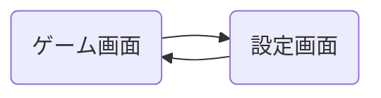

# 画面設計

## 1. オーバーレイ表示
### 1.1. 概要
- ゲーム画面上にオーバーレイ表示されるUI要素のデザイン、配置、動作について定義します。
- オーバーレイ表示は、解析開始ボタン、解析結果表示の2つの主要な要素で構成されます。

### 1.2. 解析開始ボタン
- **デザイン**:
    - 形状: 円形 または прямоугольник (未定)
    - サイズ: 48dp x 48dp 程度 ( гибкий に変更 가능 )
    - 色: 半透明の белого または серого 色 (テーマ に 合わせて 変更 可能 )
    - アイコン: 再生アイコン (開始 を 意味 する общепринятый アイコン)
- **配置**:
    - 画面の右上隅 または 左上隅 (ユーザー が 位置 を 変更 可能 に する か 検討 )
    - ゲーム画面の操作を邪魔しない位置に配置
- **動作**:
    - ボタンをタップすると、解析処理が開始されます。
    - ボタンがタップされたことをユーザーに視覚的にフィードバックする (例: ボタンの色が変化する、 анимация 効果 )。

### 1.3. 解析結果表示
- **デザイン**:
    - 表示 forma (形式): 矢印、 линия、 ハイライト など (最適な forma (形式) を 実験 的 に 決定 )
    - 色: 視認性の高い色 (例: 蛍光色、赤色、黄色 など。テーマ に 合わせて 変更 可能 )
    - サイズ: 矢印 や линия の 太さ、 ハイライト の 範囲 など は、 ゲーム画面の размер、ピース の サイズ に 合わせて 自動 調整
- **配置**:
    - 最適手を 示す ピース 上 に オーバーレイ 表示 します。
    - 複数のピースを移動する場合 は、 移動 経路 を 順 に 示す よう に 表示 方法 を 工夫 します (例: 複数 の 矢印 を использовать、 анимация 効果 )。
- **動作**:
    - 解析処理完了後、 определенное 時間 (例: 3 秒、 ユーザー が 設定 可能 に する か 検討 ) 表示 され ます。
    - 時間 経過 後、 или ユーザー が 画面 を タップ する など の 操作 で 表示 を 消去 します。

## 2. 設定画面
### 2.1. 概要
- アプリケーション の 設定 を 変更 する ため の 画面 デザイン、構成要素、遷移 について 定義 します。
- 設定画面では、以下の項目を変更可能にすることを検討します。
    - 言語設定 (日本語、英語)
    - 解析結果表示時間
    - オーバーレイ表示ボタンの位置 (オプション)
    - オーバーレイ表示デザイン (色、形状 など) (オプション)

### 2.2. 画面構成
- **画面 レイアウト**:
    - вертикальный リスト 形式 で 設定 項目 を 表示 します。
    - 各 設定 項目 に は、項目 名、 現在 の 設定 値、 変更 контрол (例: スイッチ、プルダウン、テキスト フィールド) を 配置 します。
- **ナビゲーション**:
    - 設定画面への遷移方法: メニューボタンから遷移する、 または オーバーレイ表示ボタンから遷移する (未定)
    - 設定画面からの戻り方: 戻るボタン を использовать します。

### 2.3. 各設定項目の詳細
- **言語設定**:
    - 項目名: 「言語」 または 「Language」 ( 現在 の 言語 設定 に 合わせて 表示 を 切り替え )
    - контрол : プルダウン メニュー (選択肢: 日本語、英語)
- **解析結果表示時間**:
    - 項目名: 「解析結果表示時間」 または 「Analysis Result Display Time」
    - контрол : スライダー、 または テキスト フィールド (表示 時間 を 秒 単位 で 設定 可能 )
- **オーバーレイ表示ボタンの位置**:
    - 項目名: 「オーバーレイボタン位置」 または 「Overlay Button Position」
    - контрол : プルダウン メニュー (選択肢: 右上、左上、 または 自由 配置 (ドラッグ&ドロップ) ) (オプション)
- **オーバーレイ表示デザイン**:
    - 項目名: 「オーバーレイ表示デザイン」 または 「Overlay Display Design」
    - контрол : 色 пикер、形状 選択 ボタン など ( 詳細 は 未定 ) (オプション)

## 3. 画面遷移
- **画面 遷移 図**:

- **画面 遷移 詳細**:
    - ゲーム画面 (GameScreen):
        - アプリケーション の メイン 画面 です。
        - ゲーム画面上にオーバーレイ表示UIが表示されます。
    - 設定画面 (SettingScreen):
        - アプリケーション の 設定 を 変更 する ため の 画面 です。
        - ゲーム画面から設定画面へ遷移可能です。
        - 設定画面からゲーム画面へ戻ることが可能です。

## 4. 今後の課題
- オーバーレイ表示デザインの 詳細 仕様 (形状、色、 アニメーション効果 など)
- 設定画面の 詳細 な 画面 レイアウト、 контрол デザイン
- ユーザービリティ テスト を 実施 し、 画面 デザイン を 改善 する
